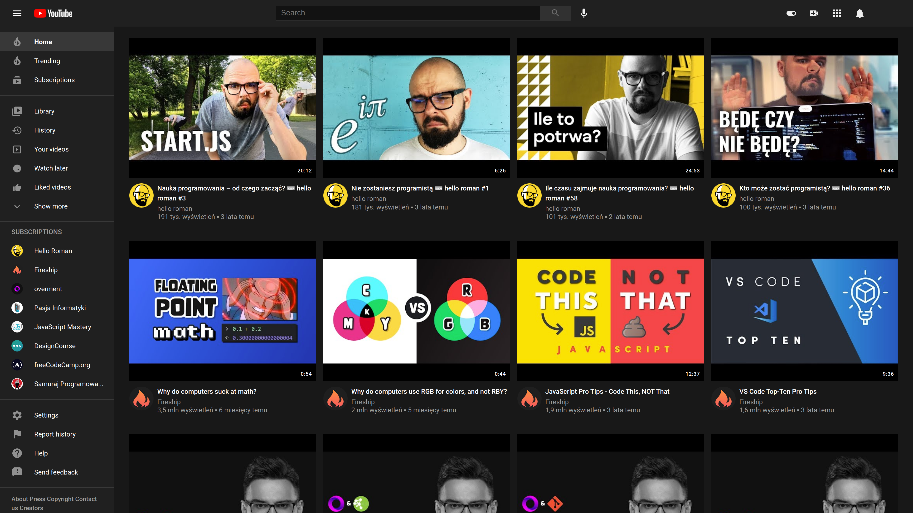

# Youtube clone

> Simple Youtube clone created with HTML, CSS & JS.

> Live demo [https://jakubparlej.github.io/youtube-clone/](https://jakubparlej.github.io/youtube-clone/).

## Table of Contents

- [General info](#general-info)
- [Technologies](#technologies)
- [Setup](#setup)

## General info

This projects is created with HTML, CSS & JS. Main goal of this projects was to practice my CSS and JS skills.

## Technologies

Project is created with:

- HTML
- CSS
- JS

## Features

- Top bar with menu button, youtube logo, search box and user settings
- Side bar menu with subscriptions list
- Hamburger icon click replace side bar menu with simple bar menu
- Main video section with most populars videos of each subscriptions channels

## Acknowledgements

This project was based on [Youtube](https://www.youtube.com). All texts and logos belong to Google LLC.

## Contact

Created by [@jakubparlej](https://jprojects.pl) - feel free to contact me!
